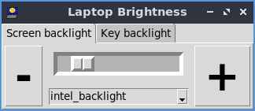

# pixel2013
Google Chromebook Pixel 2013 control

By Paul H Alfille 2021
MIT license

# Summary
Simple controls for Google Chromebook Pixel 2013 backlight and keyboard lights under linux


# Background

## Pixel 2013
The Pixel 2013 version was the premium chromebook in the first wave of chromebooks. It had beautiful aethetics, light-weight, high resolution screen, large (for chromebook) RAM and storage, and a fast processor. Even by today's standards, it's still a nice machine.

Unfortunately, Google no longer suports the 2013 Pixelbook since ChromeOS only gets [5 years of support](https://support.google.com/chromebook/answer/7052113?hl=en). With some [effort](https://www.aboutchromebooks.com/news/how-to-turn-an-old-chromebook-pixel-into-native-linux-ubuntu-laptop/), (opening the machine, removing the [protection screw](https://www.chromium.org/a/chromium.org/dev/chromium-os/developer-information-for-chrome-os-devices/chromebook-pixel), flashing the [BIOS](https://mrchromebox.tech/), and installing [linux](https://lubuntu.net/downloads/)), the machine can be repurposed.

The standard Ubuntu distribution doesn't support key and screen brightness, suspend on closing lid, and the special keys.

This program addresses screen and keyboard brightness.

## Project has moved
* This [project](https://github.com/alfille/pixel2013) is feature complete
  * Supports the Google Pixel Chromebook 2013 version
  * Further work should be in the new project
  * Any improvements there will be back-ported
* New name **backlighter**
  * A "fork" of this project
  * Supports more laptops
  * Venue for project development
* See [backlighter](http://github.com/alfille/backlighter)

# Install
* Download source `git clone http://github.com/alfille/pixel2013`
* Compile `make all`
* Install `sudo make install`
* This wil; install
  * command line tools
  * graphics tools
  * menu entry 	
* Full script:

```
git clone http://github.com/alfille/pixel2013
cd pixel2013
make all
sudo make install
```
* The following python3 modules are required (but fortunately are part of the standard distribution)
  * sys
  * signal
  * tkinter tkinter.ttk tkinter.font
  * pathlib.Path

# Usage
## command line tool
`p2013dim [-b|-k] number` -- in percent

```
p2013dim -- set the screen or keyboard brightness level for the Google Pixel Chromebook (2013)

Writes to /sys/class -- needs root privileges
by Paul H Alfille 2021

	p2013dim -b -- show backlight percent
	p2013dim -b 43-- set backlight percent

	p2013dim -k -- show keylight percent
	p2013dim -k 43-- set keylight percent

	p2013dim -b (screen backlight) is assumed if k or b not specified

	p2013dim -h -- this help
```
## graphical tool



* Program name is backlighter
  * installed in /usr/bin
  * setsuid (i.e. root privileges)
  * calls python3 program `pybacklight.py` in turn
* `pybacklight.py` is the actual program displayed 
  * For problems, run `sudo python3 ./pybacklight.py` from a terminal to see error output
  * python3 program with tkinter graphics so should need very few additional libraries
* Desktop icon and menu support
  * backlighter.desktop is included
  * menu entry should be added automatically if window manager supports OpenDesktop protocols

## Security
The controls require root access and so are setsuid programs (which is a possible security risk), but allow very circumscribed and sanitized input.

Uses the controls are exposed by the operating system in a virtual filesystem:
> * /sys/class/backlight/xxxxx/backlight
> * /sys/class/leds/xxxxx/backlight

